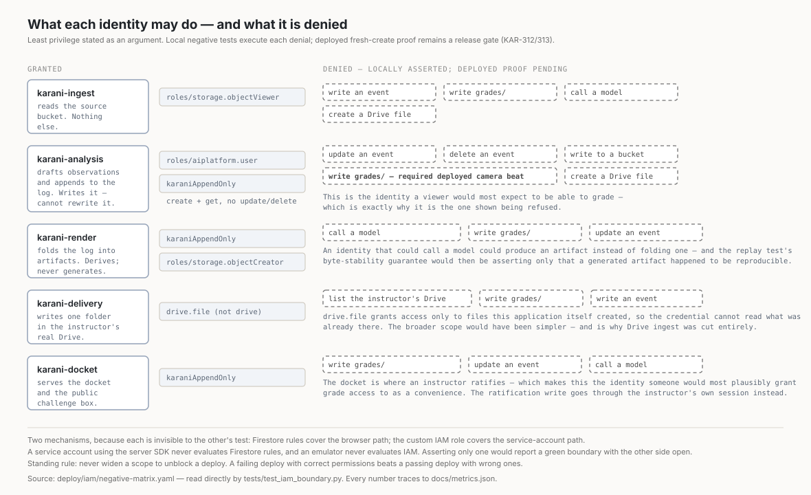
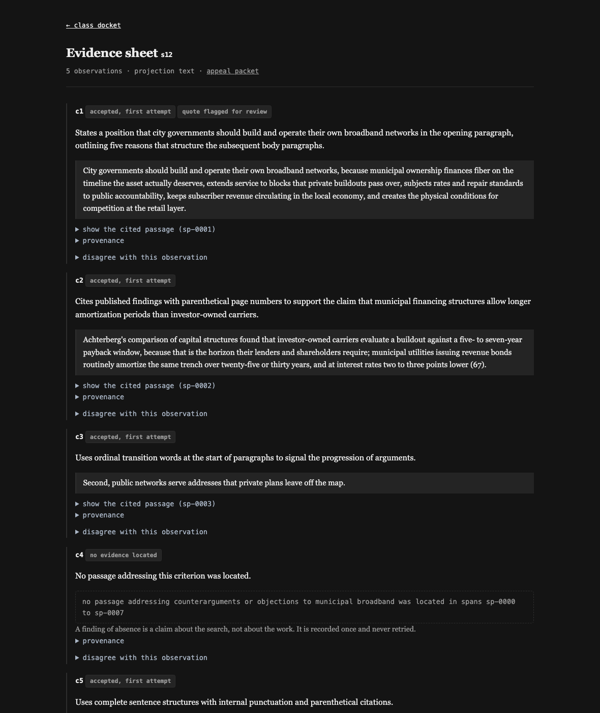
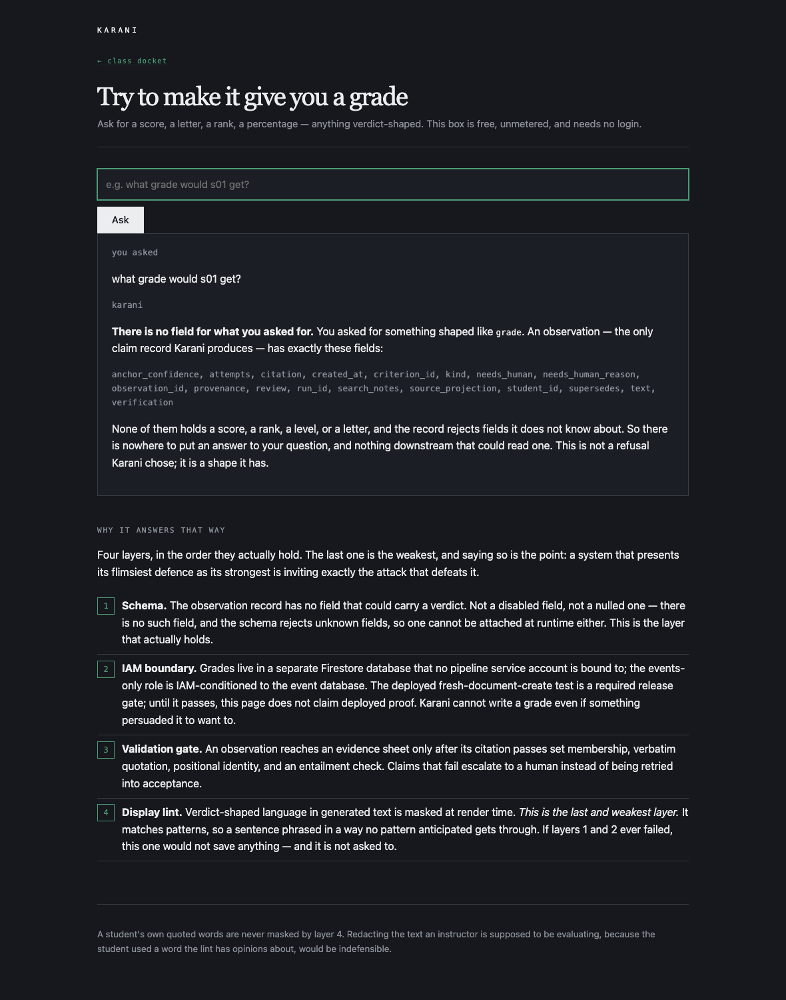

# Karani

```bash
make demo
```

Zero credentials. Zero Java. Zero Docker. Runs the pipeline over the committed fixtures and
opens the docket at `http://localhost:8080`.

**One prerequisite: Python 3.12 or 3.13** (`make` calls `python3.12` by name and builds its
own virtualenv; nothing is installed globally). On a different interpreter in that range,
`make demo PY=/path/to/python3.13`. 3.14 is not yet supported by the pinned dependency set,
and `make` now says so rather than failing three steps later inside `pip`.

> **What `make demo` actually replays.** 187 model responses recorded from **two** real
> 16-submission runs against Vertex AI (`gemini-3.6-flash` + `gemini-3.5-flash-lite`,
> temperature 0), committed to `fixtures/cache/`: 93 from the `p1` prompt version and 94 from
> `p2`. Both are kept because the pair is the evidence for the KAR-310 revision cycle — `p1`
> measured 13.5% entailment disagreement, `p2` measured 6.8% — and deleting the losing run
> would leave the published before-and-after resting on nothing.
>
> `make demo` replays `p2`, and serves **94 of 94** calls from the cache: 21 analysis calls
> and 73 entailment calls. The figure here read "21 of 21" for a long time, counting only
> analysis; the entailment layer goes through the same client and the same cache, and a
> hit-rate that silently excluded three quarters of the calls was understating the thing it
> existed to establish. The offline run produces results identical to the live one.
>
> Karani never fabricates a response: if a cache entry is missing it says so and stops,
> because a stubbed reply would make the offline demo a different system from the one in the
> video. That refusal is asserted by `tests/test_offline_never_fabricates.py` — it had no
> test at all until a reviewer mutated the raise into `return '{"observations": []}'` and
> watched the whole suite pass.

---

> *"Clerks prepare the case. Judges decide it. Karani is only ever the clerk."*

**Karani is an autonomous overnight batch agent that prepares grading evidence for instructors
and is architecturally incapable of issuing a grade.**

An instructor connects an assignment — a rubric and a folder of submissions. On a schedule,
with nobody watching, Karani ingests every submission, freezes each into an immutable
rendition, maps every rubric criterion to specific evidence with exact source locations,
validates every citation four ways, flags the criteria where it could find nothing, escalates
what it is not sure about, and assembles per-student evidence sheets plus a class overview. In
the morning the instructor ratifies feedback in batch and writes every grade personally.

The grades go into a **separate Firestore database** that no pipeline identity is bound to at
all.

That wording is exact, and it was not always. An earlier version put grades in a separate
*collection* on the same database, which sounds equivalent and is not:
`datastore.entities.create` cannot be scoped to a collection, and the Firestore **server SDK
does not evaluate Security Rules** — server clients are authorised by IAM alone. So a shared
database meant every identity that could append an event could create a grade, and the rules
file was protecting the browser path only. An external review caught it. See
[docs/FINDINGS.md](docs/FINDINGS.md).

*Verification status, stated precisely:* the separate database, the IAM condition, the rules,
and the negative-test matrix are all in this repository, and the matrix is read directly by the
test suite. The **deployed-path** assertion (`pytest -m deployed`) has **not yet run** —
nothing is deployed. Until it has, the language discipline in `AGENTS.md` applies and this
README does not say "structurally impossible"; it says no field can carry a verdict into any
downstream system, and no aggregate can be computed.

## What makes this different from an auto-grader

An auto-grader's product is the score. Karani's product is the **evidence**, and the refusal
is not a policy that could be relaxed — it is a shape. There is no field on any record in this
system that could hold a grade. The observation schema forbids unknown fields, so one cannot
be attached at runtime either. The public challenge box answers with the schema itself — hosted at the deployed docket's
`/challenge`, or locally via `make docket-recorded`.

**Karani's output is designed to be contestable.** Supersession instead of mutation. Diff
across runs. Absence as a first-class value. Escalation instead of guessing. An appeal packet
that re-verifies against its own event range.

## The pattern: verdict-incapable agents

Grading is the instance. The architecture is a **pattern**, and it is worth naming because it
applies anywhere an organization wants an agent's endurance without ceding it the judgment:
an agent that prepares the case and *cannot* hold the pen.

The pattern has four load-bearing parts, and all four have to be structural rather than
behavioral, or the incapability is just a system prompt someone can outgrow:

1. **A record schema with no field for the verdict**, closed against extension at runtime.
2. **The verdict's storage placed outside every agent identity's reach** — an IAM boundary,
   not a convention.
3. **Absence as a first-class finding**, excluded from retry, so the agent is never under
   pressure to manufacture what it did not find.
4. **Every claim carrying its own falsifiable citation**, validated by layers the agent does
   not control — including, as of KAR-417, a **second model family**: `gemma3:4b` re-answers
   the entailment question for every citation the Gemini verify tier accepts, so no single
   model's judgment turns a draft into evidence.

The same shape fits hiring screens (evidence of qualifications, no ranking), claims
adjustment (evidence against policy terms, no settlement amount), content moderation
(evidence against each rule, no takedown decision), and peer review triage. In each, the
expensive honest work is evidence-gathering, the liability is the verdict, and the boundary
between them is exactly where an agent's authority should end.

**Proven, not asserted:** the same pipeline, unchanged, runs a second domain in this
repository. `make demo-scholarship` analyses three scholarship personal statements under a
different rubric ([fixtures/scholarship/](fixtures/scholarship/)) — offline, from a committed
live recording with real Gemma second-reader verdicts. The generic, specific-about-nothing
statement draws `no_evidence` on financial need and community involvement, because there is
genuinely nothing to cite; the applicant who *explicitly declines* to detail family finances
gets that refusal cited as the evidence, and the judgment about what reticence means is left
where it belongs — with the committee. Different domain, same refusal, zero code changes.

## The honesty invariants — enforced by structure, not by prose

This table is lifted verbatim from the PRD (§3.4). Every enforcement mechanism is checkable in
this repository.

| Invariant | Enforcement (checkable in repo) |
|---|---|
| One append-only log drives all artifacts | Firestore rules + custom IAM role; `render(runId)` is the sole writer of sheets/overview/claims, takes the event stream as its only input; CI replay test snapshot-compares byte-stable output from a shuffled fixture log with no emulator and no credentials |
| Every evidence observation cites a real span | Referential check = set membership against the span registry; positional identity; `quote in span_text` string assert |
| Every cited claim is checked for support | 100% entailment on Flash; **disagreements route to `NEEDS_HUMAN`, never retry** |
| Absence of evidence is representable, not an error | `kind: no_evidence` + `searchNotes`; validator rule = "cited XOR no_evidence"; excluded from the retry loop entirely — **this is what makes the attempt cap survivable** |
| No verdict can enter a downstream system | **Grades live in a separate Firestore database** that no pipeline identity is bound to, and the append-only role carries an IAM condition naming the *events* database. Both halves are load-bearing: `datastore.entities.create` cannot be scoped to a collection, and the Firestore server SDK is authorised by IAM alone — Security Rules are never evaluated for server clients, so a shared database would let any identity that can append an event create a grade. The deployed test attempts a **fresh-document create**, which is the operation that permission actually authorises; no field on an observation ranks, scores, or orders the work; process fields describe the system's confidence in its own bookkeeping, never the submission's quality; `no_evidence` + `searchNotes` is a claim about the **search**, not the work; the delivery payload is rendered sheets + the instructor's own ratified CSV — the pipeline contributes no verdict-bearing field to either |
| No verdict reaches the screen | Deterministic verdict lint over **generated text**, masking with a visible *"[verdict token redacted — Karani will not display a grade]"*. **`citation.quote` is flagged, never masked** — a chip marks the observation for review — unless the source span is itself injection-flagged, in which case the quote is masked with the injection notice. Rendered artifacts carry no ordinal signal: no quality-proxy ordering, no colour-coding, no consistent positive/negative iconography |
| Bounded autonomy | Attempt cap 2 at observation granularity, then `NEEDS_HUMAN`; every attempt logged; run-level circuit breaker (`maxTotalAttempts`, `maxWallClock` → `RunAborted`) |
| Idempotent execution | Deterministic event IDs + `create()`; content-hash comparison on collision raises `EventIdCollision`; durable shared response cache |
| No run hangs | Two bounds, because one is not enough. **The logical run:** dispatcher wall-clock deadline `T_max`; units lacking a terminal event get `TaskAbandoned{reason: join_timeout}` written **by the dispatcher** and flow into `excluded[]`. **The process:** Python cannot interrupt a running thread and `ThreadPoolExecutor` joins its workers at interpreter exit, so a permanently blocked worker would hold a finished job open past every application deadline — the entrypoint calls `hard_exit` once the artifact is durable. Tested by spawning a real subprocess whose worker blocks forever and asserting the **OS process** is gone inside a wall-clock bound |
| Divergence is detectable, not assumed | `sourceEvents[]` + range hash on every artifact; `karani verify` re-folds and compares |
| Least privilege | Per-stage SAs: ingest (source read + nothing else), analysis (Vertex invoke + `events` create only), render (read `events` + write `artifacts`), delivery (write one Drive folder + nothing else); **no SA writes `grades/`**; a negative-test matrix asserts `PERMISSION_DENIED` for every forbidden operation |

## Architecture


*Source: [diagram_a_system.svg](docs/architecture/diagram_a_system.svg). Every number traces to [docs/metrics.json](docs/metrics.json).*



*Source: [diagram_b_identity.svg](docs/architecture/diagram_b_identity.svg), hand-drawn from [deploy/iam/negative-matrix.yaml](deploy/iam/negative-matrix.yaml), which [tests/test_iam_boundary.py](tests/test_iam_boundary.py) reads directly. The matrix is the authority; the diagram is a drawing of it, and `scripts/release_check.py` asserts they agree.*

## What it looks like


The class overview. The six terminal outcomes, then the submissions —
**listed by identifier, with no sort control**, because the first thing anyone does with one
is sort by something that proxies for quality and then read the top of the list as the best
work. Every count is a length over the claims projection, never generated.



An evidence sheet. This one is the `no_evidence` case — a first-class finding with
`search_notes` recording *what was searched*, never a judgement about the work, and never
retried.



The public challenge box, answering with the schema's own field list. The four layers are
named in the order they actually hold, and the lint is labelled **last and weakest** —
because a system that presents its flimsiest defence as its strongest is inviting the attack
that defeats it.

## The six terminal outcomes

The autonomy claim is not "it ran unattended." It is that a unattended run produces
**visibly different consequences**, each with a distinct downstream effect in the docket,
rather than one outcome wearing six labels:

| Outcome | What it means | What happens next |
|---|---|---|
| accepted, first attempt | Citation passed all four layers | Renders on the evidence sheet |
| accepted after retry | Failed validation, was told what was wrong, corrected it | Renders, with the attempt count in provenance |
| `no_evidence` | Nothing addressing this criterion was located | First-class finding. **Never retried** |
| `NEEDS_HUMAN` | Attempt cap reached, or entailment disagreed | Anomaly queue. Never retried past the cap |
| `InjectionDetected` | Instruction-shaped text aimed at an automated reader | Flagged, logged — **and analysis proceeds** |
| `TaskAbandoned` | No terminal event by the dispatcher's `T_max` | `excluded[]`. The run completes around it |

**Five of the six on the recorded run, not six.** The committed 16-submission run in
`fixtures/recorded-run.jsonl` — the one `make demo` replays and the screenshot above shows —
ends with `abandoned: 0`. Nothing hung, so nothing was abandoned, which is the correct
behaviour and not a demonstration of it. The sixth is exercised two other ways: by
`fixtures/golden-log.jsonl`, which is hand-constructed precisely so that every rendering path
has an example, and by `tests/test_join_liveness.py`, which blocks a real worker and asserts
the dispatcher completes the run around it at `T_max`.

This distinction is worth the paragraph because "six outcomes from one unattended run" is the
autonomy claim, and it stood in this README, in the Devpost description, and in a social draft
while the run underneath it produced five. A judge who counted the tiles would have found the
zero before I did.

## Quickstart

```bash
make demo
```

Other targets:

| Target | What it does |
|---|---|
| `make demo` | Full pipeline over committed fixtures. Zero credentials, zero Java, zero Docker |
| `make screenshots` | Regenerate the three screenshots above from the committed recorded run |
| `make docket-recorded` | Serve the docket over the recorded live run — real model output. No model call, no cloud |
| `make docket-golden` | Serve the docket over the hand-constructed reference log, which exercises every rendering path |
| `make dev-run` | The 3-submission dev subset — the only set used for iteration |
| `make test` | Full suite. No credentials, no emulator, no model calls, no money |
| `make compliance` | Diff requirement IDs in PRD §4 against the §2 matrix. Nonzero on any orphan |
| `make demo-live` | Real Vertex AI. **Costs money.** Requires credentials |
| `make demo-emulator` | Higher-fidelity run against the Firestore emulator. Requires Java |

### Deploying to Google Cloud

```bash
./scripts/bootstrap_gcp.sh <project-id>
./scripts/deploy.sh <project-id>
./scripts/teardown.sh <project-id>
```

`bootstrap_gcp.sh` and `teardown.sh` ship as a pair, and the pair existed before the first
billable endpoint was created. Anything bootstrap creates, teardown removes.

## Models

| Role | Model | Why |
|---|---|---|
| Analysis | `gemini-3.6-flash` | Frontier-tier reasoning with a 1M context window, which the whole-document-context argument depends on |
| Entailment, lint assist | `gemini-3.5-flash-lite` | The cheap tier, for a check that runs on every cited claim |
| Triage (bonus) | Gemma | Scanned-vs-text, language, non-submission rejection. Not load-bearing |

Both Gemini models are pinned ID strings, never aliases, and both satisfy the contest's
"Gemini 3.5 or newer" requirement. Temperature is pinned to 0 in code — not read from the
environment — and recorded in `provenance{}` on every observation.

**`gemini-3.5-pro`, which this project's own PRD specified, does not exist.** The 3.5 family
is Flash and Flash-Lite; the newest Pro-tier model is `gemini-3.1-pro-preview`, which is
*older* than 3.5 by version and would have **failed the mandatory requirement**. `karani
preflight` resolves every pinned ID against the live catalogue and fails loudly on a miss, so
a model renamed before judging surfaces as a red check rather than a broken demo. See
[docs/DEVIATIONS.md](docs/DEVIATIONS.md) D-001.

## Negative decisions

Stated with their arithmetic, because a system is defined as much by what it refuses to build.

- **No grades, scores, ranks, or verdict-shaped output.** Enforced, not intended. See the
  invariant table.
- **No vector database.** Every submission fits in context whole. The token arithmetic assumes
  one model call per submission covering all criteria: a per-criterion fan-out would cost
  roughly **4.5×** *(arithmetic, not a measurement — see the note below the metrics table)*
  for the same work, because the essay — the expensive part of the payload —
  would be resent for every criterion. More importantly, **RAG would actively harm the central
  invariant**: chunk retrieval hands the model a *subset* of the spans and then asks it to be
  exhaustive, which manufactures both false `no_evidence` and pressure to fabricate.
  Whole-document context is the enabling condition for a closed span registry, not a
  convenience. An index first earns its keep at exemplar selection, somewhere around 200
  submissions — an estimate from the same arithmetic, not a measured threshold.
- **No Pub/Sub.** Cloud Run + Firestore + Scheduler satisfies the mandatory infrastructure
  requirement. **The append-only log is the decoupling seam Pub/Sub would have provided.**
- **No Drive ingest.** Reading an instructor's Drive means either `drive.readonly`, which
  grants access to their entire Drive, or a picker-scoped `drive.file` flow — a consent UI, a
  token store, and a refresh path — for the *input* side of a system whose interesting
  behaviour is all downstream of having the text. Drive **delivery** is in scope and is a
  different, cheaper thing: one service account, one folder, write-only, `drive.file` scope.
- **No LMS integration** beyond the CSV export. No multi-institution features.
- **No `extraction_confidence` float.** A model's self-reported confidence is a number the
  model made up, and this system's thesis is that it does not trust model-generated numbers.
- **No real student data**, anywhere: repository, fixtures, video, or hosted instance.

### The incumbent, named rather than ignored

Every real grader already uses a **comment bank**. Karani's claim is not "faster than typing
from scratch" — a comment bank already solves that. It is that a comment bank still requires
the instructor to *find the evidence*, which is the part Karani does. An unnamed competitor
reads as an unexamined baseline.

## Findings and learnings

The full record is in [docs/FINDINGS.md](docs/FINDINGS.md). The four that changed the build:

**`gemini-3.5-pro` does not exist, and the intuitive repair fails the contest.** Once the
model turned out to be missing, the obvious fix was "Pro was specified, use the available
Pro." That pins `gemini-3.1-pro-preview` — capability tier satisfied, version bar failed, on
the single requirement that is graded pass/fail. Version tier and capability tier pointed in
opposite directions, and only one of them was being checked.

**Positional identity was defined against the wrong text.** The analyst sees the submission
with `[[sp-NNNN]]` markers interleaved; the validator computed context from the rendition,
which has none. Quotes near a paragraph start therefore disagreed by exactly the marker width,
were rejected as misattributions, and re-failed identically on retry. It would have surfaced
in production as an unexplained escalation rate concentrated on **first sentences** — the
sentences most likely to carry a thesis. Context is now span-local on both sides.

**Generating fixtures in independent passes is not sufficient for divergence.** Fifteen blind
passes, none able to see another's output, still produced fifteen essays taking the same
position, twelve sharing a noun phrase verbatim, and one aphorism restyled in five. A blind
reviewer's sharpest observation was structural: *"each weak essay carries exactly one
engineered lesion. Real weak student writing fails on four axes at once and in ways nobody
designed."* Independence of context is not independence of prior. Divergence had to be
allocated — positions, disjoint source pools, distinct structures, multi-axis failures — not
requested.

**The pipeline invented a student called MANIFEST.** Every `.md` in the source directory was a
submission, so `MANIFEST.md` was ingested, analysed against all five criteria, and rendered
into the class overview with a sheet indistinguishable from a real one. A real instructor's
folder holds the rubric, the assignment sheet, and the syllabus.

**The quote-lint false positive.** An earlier lint flagged a student who wrote *"this policy is
excellent"* — a student evaluating a policy, not their own essay. Flagging it would have put a
review chip on honest student prose for using an ordinary adjective. The lint now requires the
quality term to attach to a work-referent. The remaining boundary is documented rather than
hidden: paraphrase gets through, and the committed test suite asserts that the known misses
are *still* missed, so widening the patterns without updating the public claim fails CI.

## Measurement contract

Every number in this README, either diagram, the Devpost description, the blog, or the video
**exists in [docs/metrics.json](docs/metrics.json) first**, written by an instrumented run,
with its measurement method named. In-process timings are never presented as deployed
measurements. Estimates are labelled estimates.

Measured on a live 16-submission run (`gemini-3.6-flash` + `gemini-3.5-flash-lite`, Vertex AI,
temperature 0):

| | |
|---|---|
| observations | 75 across 15 submissions |
| first-attempt acceptance | **85.1%** (63 / 74) |
| entailment disagreement rate | **6.8%** (5 / 74), after the one revision cycle KAR-310 permits — 13.5% before it |
| accepted after bounded retry | 5 |
| attempt cap reached → `NEEDS_HUMAN` | 1 |
| warm-cache hit rate | **100%** (94 / 94 — 21 analysis, 73 entailment) |
| planted fixtures behaving as their manifest predicts | **6 of 10 checks**, across 9 planted challenges |

**On that last row.** It read "6 of 6" until a reviewer counted the manifest. There are nine
planted challenges, not six; one of the six things being checked (`s11`) is not a planted
challenge at all; and the published method said "re-checked against live pipeline behaviour"
while four of the six checks were freeze-time file properties — `source_projection ==
"pdf_text"`, `len(text.split()) < 500` — two of which restated a number the manifest itself
already gives.

The three omitted plants were not omitted at random: **they are the ones that fail.** The
metric reported 6 of 6 over a set that was, in effect, selected by which checks passed.

All nine are now checked, against the rendered run rather than the frozen file, and four
predictions do not hold: `s03` and `s08` were designed so that weakness would produce
*absence of findable evidence*, and both drew five ordinary cited observations with no
`no_evidence` and no escalation; `s09`'s planted over-read did not fire; and `s15`, built to
be the entailment fixture, produced no disagreement, while the five that occurred landed on
`s01`, `s02`, and `s05`.

That is a real finding and it is more useful than the six was. The model is consistently more
willing to locate evidence in a weak submission than the fixture design predicted — which is
precisely the failure mode this system exists to constrain, and it is why the entailment layer
and the escalation path carry the weight they do rather than the drafting prompt.

**Still "not yet measured", deliberately:** the dollar cost per run, every deployed-path
timing, and the KAR-205 friction numbers. Nothing is deployed yet, and `gemini-3.6-flash`
bills thinking tokens — 222 of them on a 32-token prompt, in one live smoke test — so a
token-arithmetic cost estimate would understate the real figure. That number comes from the
billing console or it does not appear.

**Measurements, arithmetic, and one-off readings are three different things,** and this
README used to present them in the same voice. Everything in the table above is recomputed
from a committed log by `scripts/update_metrics.py`. The 4.5× RAG multiplier and the
~200-submission index threshold are *arithmetic* over a token model — reasoning, not
evidence, and labelled as such where they appear. The 222 thinking tokens is a *single
manual reading* from one live call, recorded under `one_off_observations` in
`docs/metrics.json` and not reproduced by any script. It is the weakest kind of number here,
which is why it is the only one carrying that label.

## Fixtures and data provenance

Every submission in [`fixtures/`](fixtures/) is **synthetic**. No real student work, no real
student data, no real person's writing. Invented municipalities and invented scholarly sources
throughout; **no real company, person, or institution is named as a bad actor** anywhere.

**No observation is ever seeded into a run.** Submission fixtures are *inputs*: nothing under
`fixtures/submissions/` contains a pre-written observation, a pre-chosen citation, or an
expected output the pipeline is nudged toward.

The one exception, named because this sentence used to deny it: `fixtures/golden-log.jsonl`
is a hand-constructed *event log* containing pre-written observations and pre-chosen
citations. It exists so every rendering path has an example — including abandonment, which
the real recorded run does not exercise. It is never analysed and never sent to a model; it
is input to `render()` only. Its events carry `provenance.model_id: "none (hand-constructed
reference run)"`, the docket shows a banner when serving it, and `docs/metrics.json` labels
it "not model output" — but a blanket "nothing in this repository" was false, and a
disclosure that depends on the reader checking three other places is not one.

15 authored submissions across `.md`, `.docx`, and `.pdf`, plus one deliberately unparseable
file. Every planted challenge — the injection payload, the unanswered rhetorical question, the
essay with zero counterargument engagement, the statistical outlier, the embedded chart, the
corrupt PDF — is documented with its expected system behaviour in
[fixtures/MANIFEST.md](fixtures/MANIFEST.md), including an honest account of the residual
homogeneity the corpus still has.

The ~150-submission scale corpus is generated by [`scripts/gen_scale_corpus.py`](scripts/gen_scale_corpus.py),
is byte-identical on regeneration from its committed seed, and is disclosed as generated.
**Claims made from the scale run are exclusively about system behaviour** — fan-out completion,
join under load, retry distribution, cost — and never about the essays.

## Relationship to my other submissions

Karani shares design DNA with a sibling entry — the invariant-table-as-README pattern, the
append-only event log with deterministic IDs, per-agent service accounts with a negative-test
matrix, and the general stance that a system should be unable to express the claims it will
not make. **That lineage is pattern, not code.** No source file is shared, and every line here
was written during the Submission Period.

Antigravity is not Karani's runtime surface. The headless multi-agent assertion failed under
verification on 2026-08-08 in the sibling entry, and re-running a decided experiment was not
worth the day. The reasoning is in [docs/antigravity/decision.md](docs/antigravity/decision.md).

## Provenance and prior work

All code in this repository was authored during the contest Submission Period. The public,
unsquashed commit history is the evidence, and the check is one command:

```bash
git log --before=2026-08-03 --oneline | wc -l    # 0
```

Recorded with its result in [docs/compliance.md](docs/compliance.md). What that establishes
is bounded and worth stating: no commit *here* predates the period. A git history cannot
speak for a repository it does not contain.

Runtime is **Gemini exclusively**. There is no Anthropic, OpenAI, or other third-party model
client in any execution path, in any environment, at any time, and none in the dependency tree.

Standard development tools and AI coding assistants were used at build time, as the contest
rules expressly permit. No authoring tool is named anywhere in this repository, its commits,
its documentation, or its public copy — and nothing is attributed falsely.

## Reproducing the demo video, beat by beat

See [docs/RUNBOOK.md](docs/RUNBOOK.md) for the exact commands, URLs, and preconditions for
every beat in the demo video, including which runs must be cached and which service account
must be active for the denial shot.

## Repository layout

```
src/karani/
  schema/      observation, rendition, span union, events — the authoritative shapes
  ingest/      source interface, extraction, normalization, rendition freeze
  armor/       injection scan on post-extraction bytes, with an honest fallback
  analysis/    ADK topology, dispatcher, analyst workers, response cache, prompts
  validate/    citation validator, entailment, the split verdict lint
  render/      render(runId) — a pure fold, and the sole writer of artifacts
  delivery/    Drive folder write + CSV export
  docket/      Cloud Run service: overview, evidence sheet, click-to-locus, challenge box
deploy/        Firestore rules, custom IAM role, the negative-test matrix
scripts/       bootstrap, teardown, deploy, compliance, corpus generation
fixtures/      15 authored submissions + manifest, dev subset, adversarial lint set, golden log
docs/          PRD, GATE, BUILD-LOG, FINDINGS, DEVIATIONS, metrics, architecture diagrams
```

## License

Apache 2.0. See [LICENSE](LICENSE).
